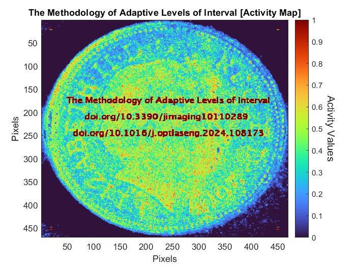

# The Methodology of Adaptive Levels of Interval for Laser Speckle Imaging

This repository contains a Matlab implementation of the Methodology of Adaptive Levels of Interval for Laser Speckle Imaging.

## Implementations

This method is implemented in the MATLAB programming language.

## Getting Started

The repository contains three MATLAB files.

* ALIM.m : Implements the mathematical equations for the Methodology of Adaptive Levels of Interval.
* Speckles.mat : 3D Matrix file, contains 164 dynamic speckle patterns with resolutions of 470x470 pixels.
* Demo.m :  This file demonstrates the effectiveness of the ALI methodology on the extraction and discrimination capabilities of standard speckle pattern methods. It reads dynamic speckle patterns from the "Speckles.mat" file, processes them using the "ALIM.m" function, and displays the extracted activity map. It also allows the user to select different "Time-variant intensity analysis approaches" that correspond to the standard speckle pattern methods.

<p align="center"></p>

## Paper Abstract

A methodology is proposed for use in the laser speckle imaging field. This methodology modified the graphical and numerical speckle pattern imaging methods to improve their extraction and discrimination capabilities when processing the embedded temporal activity in the images of laser speckle patterns. This is through enabling these methods to adapt the levels of speckle images’ interval during processing to speed up the process and overcome the lack of discrimination when they deal with a complex scattering medium having regions of various scales of activity. The impact of using the new methodology on the imaging methods’ performance was evaluated using graphical and numerical evaluation tests, in addition, an exceptional laser speckle imaging system was designed and implemented to undertake a series of experimental validation tests on this methodology. The evaluation and experimental validation tests show the effectiveness of this methodology on the extraction and discrimination capabilities for the standard imaging speckle pattern methods and prove its ability to provide high performance with the real images of speckle patterns. The results also show an improvement in the processing speed for both graphical and numerical methods when the adaptive levels methodology is applied to them, which reaches 78% for the graphical and 87% for the numerical speckle processing methods.

In return for making this code available, I would appreciate that you cite the following publications:

* Al-Temeemy AA. The Methodology of Adaptive Levels of Interval for Laser Speckle Imaging. Journal of Imaging. 2024; 10(11):289. https://doi.org/10.3390/jimaging10110289

* Ali A. Al-Temeemy, ALI: The adaptive levels of interval method for processing laser speckle images with superior activity extraction and discrimination capabilities, Optics and Lasers in Engineering, Volume 178,
2024, 108173, ISSN 0143-8166, https://doi.org/10.1016/j.optlaseng.2024.108173

How to cite this repository:

see "ALIM.bib" file \[BiBTeX format]


```bibtex
@article{ALTEMEEMY202410110289,
title = {The Methodology of Adaptive Levels of Interval for Laser Speckle Imaging},
author = {Ali A. Al-Temeemy},
journal = {Journal of Imaging},
volume = {10},
number={11},
article-number={289},
year = {2024},
issn = {2313-433X},
doi = {10.3390/jimaging10110289},
url = {https://www.mdpi.com/2313-433X/10/11/289},
PubMedID = {39590753}
}
```

```bibtex
@article{ALTEMEEMY2024108173,
title = {ALI: The adaptive levels of interval method for processing laser speckle images with superior activity extraction and discrimination capabilities},
author = {Ali A. Al-Temeemy},
journal = {Optics and Lasers in Engineering},
volume = {178},
pages = {108173},
year = {2024},
issn = {0143-8166},
doi = {https://doi.org/10.1016/j.optlaseng.2024.108173},
url = {https://www.sciencedirect.com/science/article/pii/S0143816624001520}
}
```


## Author

Ali A. Al-Temeemy is a Professor in the Department of Laser and Optoelectronics Engineering at Al-Nahrain University and an honorary research fellow in the Department of Electrical Engineering and Electronics at the University of Liverpool.

## License

See the License file for details.

